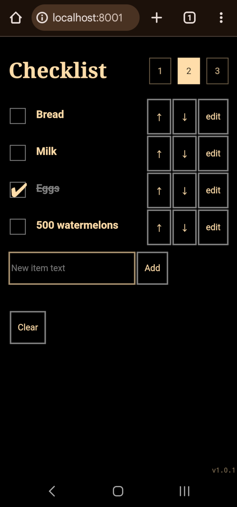

# Simple Local Browser Checklist

Do you need the ability to quickly make a checklist on your phone? Do you want
it to have basically no useful features, support no more than ~~one~~ (update:
THREE!) list(s) at a time, and be impossible to synchronize across devices?

If so, this is the HTML file for you! I have no idea how this works on apple, but
on an android, you can run this in one of two ways:

1. The non-techy way: just download [the HTML
   file](https://github.com/WarmCyan/browser-checklist/releases/download/v1.0.0/index.html)
   and then open it from your filemanager in a web browser (notably the firefox
   app can't do this...but chrome/vivaldi/etc. work fine). Your file manager
   probably also allows you to pin a shortcut to your home screen.
2. The techy way: grab the repo in termux and host the containing folder with
   python via `python -m http.server [PORT]` or use the accompanying `run.sh`,
   then open the browser of your choice (firefox does of course work with this
   method) to `localhost:[PORT]`

The (single) checklist is stored in local browser storage, so it will persist
across you closing the tab/your browser app. The 1 2 3 buttons at the top allow
you to switch between three different stored checklists. Use this expanded
memory wisely! (Initial release supported only one.)

Also, everything is in a single file, and when you download it it's yours, so
you can customize functionality and styling to your hearts content!
